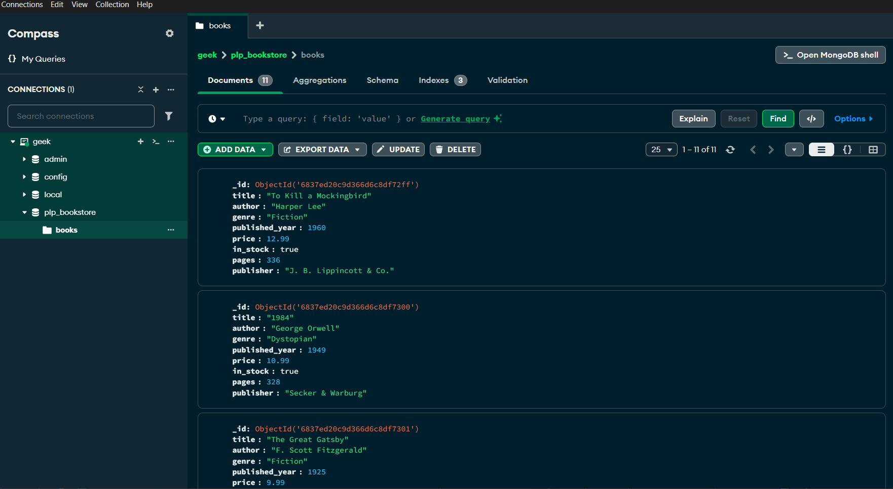

# PLP Bookstore MongoDB Assignment

This project demonstrates basic MongoDB operations using Node.js. It includes scripts to populate a sample bookstore database and run queries.

## Prerequisites
- [Node.js](https://nodejs.org/) installed
- [MongoDB](https://www.mongodb.com/try/download/community) running locally or use MongoDB Atlas

## Files Included
- `insert_books.js` – Script to insert sample book data into MongoDB
- `queries.js` – (Script to run your own queries)

## How to Run the Scripts

### 1. Install Dependencies
Install the MongoDB Node.js driver:
```bash
npm install mongodb
```

### 2. Insert Sample Books
Run the following command to populate your MongoDB database with the sample books:
```bash
node insert_books.js
```
- This connects to your local MongoDB server, drops the `books` collection if it exists, and inserts the sample data.
- You will see a list of inserted books in your terminal.

### 3. Run Your Own Queries
- The `queries.js` file includes my MongoDB queries using the Node.js driver.
- Run your queries with:
```bash
node queries.js
```

## Example MongoDB Queries (for use in the MongoDB shell or Compass)
- Find all books:
  ```
  db.books.find()
  ```
- Find books by a specific author:
  ```
  db.books.find({ author: "George Orwell" })
  ```
- Find books published after 1950:
  ```
  db.books.find({ published_year: { $gt: 1950 } })
  ```
- Find books in a specific genre:
  ```
  db.books.find({ genre: "Fiction" })
  ```
- Find in-stock books:
  ```
  db.books.find({ in_stock: true })
  ```

## Screenshot
Added a screenshot of your MongoDB Compass  showing my `plp_bookstore` database, `books` collection, and sample data below:




